I've wanted to fabricate my own steel bike frame "[from scratch](https://www.youtube.com/watch?v=7s664NsLeFM)" ever since I saw a frame jig sitting in the back corner of the Bradley Street Bicycle Co-op ([BSBC](http://bsbc.co/)). A frame jig (technically a [fixture](https://www.quora.com/What-is-the-difference-between-a-jig-and-a-fixture)) is an adjustable metal structure that holds and locates the tubes of a bike frame before they can be welded. My friend John Martin (BSBC's founder) had obtained it from a framebuilder based out of Artisan's Asylum in Boston, and has built a few frames with it over the years.

In January 2019, I was growing tired of riding my rim-brake-equipped commuter bike during winter. I wanted disc brakes for better braking performance in rain and snow, and hopefully fewer grinding noises that occurred when my wheel would pick up salt and sand from the roads. After returning from our Tucson bikepacking trip, I set out to design and fabricate a new frame for commuting duties!

The key features I wanted were:
- Disc brakes
- 1-1/8" threadless fork
- Support for 1x9 drivetrain, including clearance for a 42t chainring
- Long, exposed 27.2mm seatpost (inspired by [Rob English](https://www.englishcycles.com)). The longer/thinner a seatpost is, the more it flexes when the bike rolls over bumps or encounters excess vibration. I could talk about this and the myths surrounding vertical compliance at length, but I'll save it for another post!
- 26x2.2" tires for comfort, traction, and puncture resistance. The Continenental Race King Protection MTB tire is [very fast](https://www.bicyclerollingresistance.com/mtb-reviews/continental-race-king-protection-2020) with a rolling resistance of ~16w (tubeless @ 25psi / 18mph). For reference, that's faster than many slick road tires like the Continental Gatorskin (22w tubed @ 80psi / 18mph), so I wasn't scared of losing any speed.
- Traditional (skinny) steel tubing dimensions wherever possible. I wasn't planning on doing any hardcore mountain biking on this, so there wasn't any need to maximize stiffness or strength. I also like some lateral flex when pedaling.

## Design

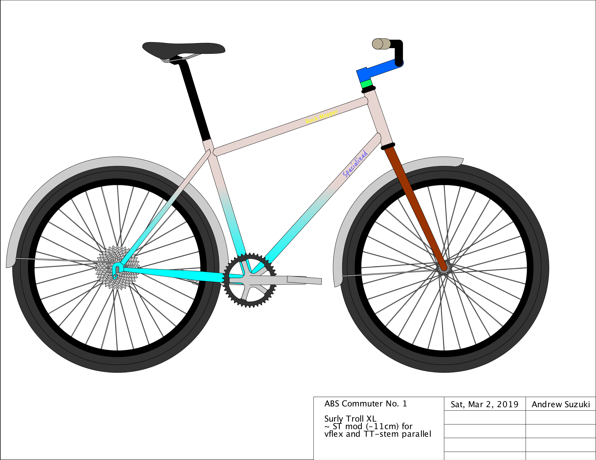

The basic geometry is based off the Surly Troll XL. The main difference is that I shortened the seat tube by about 11cm (therefore changing both seatstay and top tube length/angle). This change didn't affect any other primary dimensions, so I was sure it would still size and handle essentially like a Surly Troll.

I used [BikeCAD](https://www.bikecad.ca) to design the frame. You begin by entering primary dimensions such as head tube length/angle, front center, seat tube length/angle, chainstay length, and BB drop. From there, I mocked up the components, often by seeing what user inputs were available, then measuring the components with calipers.

To determine the actual tubing dimensions, I went back and forth between the individual tube requirements (usually just length), and what was available at [Nova Cycles](https://www.cycle-frames.com/) (bicycle tubing supplier) at different diameters and wall thicknesses. To my surprise, I ended up being able to use "standard"/traditional tube diameters for all of the main tubes.

The hardest part of tubing selection was finding the right chainstays. The goal for most dirt-ready bikes is to maximize tire clearance while also being able to fit a large-enough chainring. In my case, since I'm mostly going to be riding on pavement with the aforementioned gotta-go-fast tires, my requirement for a chainring was quite large at 42t (at least for an MTB). Therefore, I had to find a chainstay that would snake right between the large chainring and large tire in accordance with my defined chainstay length, bb-chainstay offset, chainline, etc. To make things even more complicated, many available chainstays don't have any bend specs available (especially from Nova), and BikeCAD has a different way of dimensioning the chainstay bends than manufacturers. In the end, I did some trig and finally decided on one of Columbus' available s-bend chainstays, though it was still a bit of a wager as I wasn't 100% sure it would work with my requirements. More-experienced framebuilders often bend chainstays to spec themselves, but I decided that putting together a bending setup would be too much of a time/money commitment for my first frame.

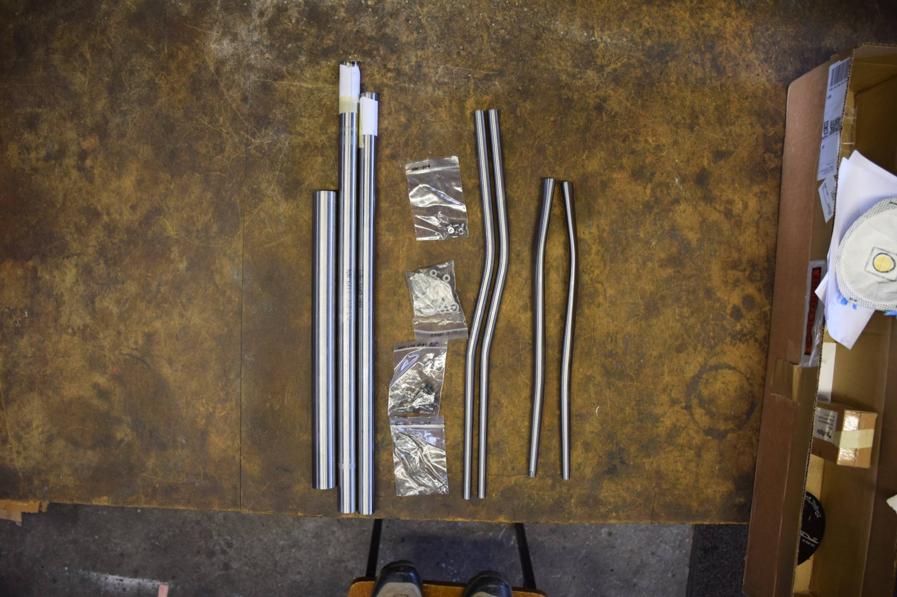

In the end, this was my order from Nova:
- Nova 25.4mm 9/6/9 top tube
- Nova 28.6mm 8/5/8 down tube
- Nova 28.6mm 9/6 seat tube
- Nova 36.0mm head tube
- Nova 16mm S-bend seatstays
- Nova lugless superlight BB shell
- Columbus Zona MTB S-bend chainstays
- ISO disc brake tab
- Zip tie brake cable guides
- Water bottle bosses

There were already some Henry James vertical tabbed dropouts at the shop, so I used those.

## Jig Setup

<!-- TODO jig photo -->

The first step is to adjust the jig to match the design's primary dimensions. Unfortunately, this particular jig was extremely problematic. It's held together by square steel tube and fastened by the compression of bolts and washers. However, the compression needed to hold it together was enough to bend not only the washers but also spread the square steel tubes apart. This completely threw the jig out of alignment, possibly 5mm out of plane. I went ahead and used the jig as-is. Metal bike frames are usually bent after welding anyways -- I simply opted to bend it more than what would otherwise be required (wager #2).

## Tube Mitering

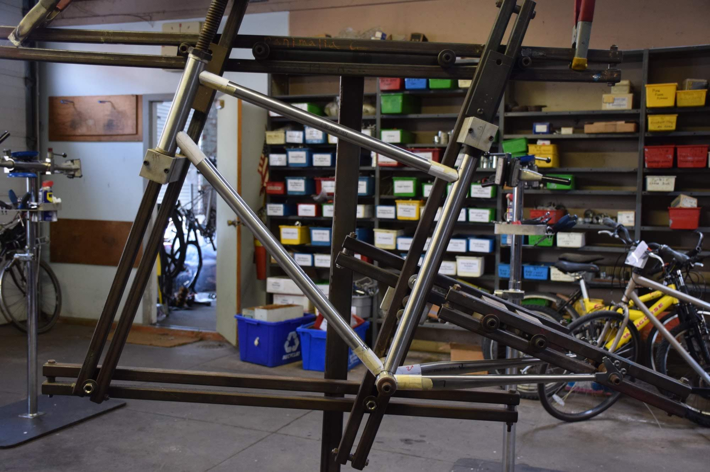

For most of the joints of a bike frame, the end of a tube is cut to fit up against the side of another tube. Outside of bicycle framebuilding, this process is usually called tube notching or coping, though in bicycle framebuilding it's most commonly called *mitering*. The exact profile of the cut depends on the diameters of the two tubes, the wall thicknesses, and the angle.

The professional mitering method is to use ordinary hole saws mounted in a milling machine, however, I didn't have access to a mill at the time. Instead, I used a combination of hand files and a bench grinder. Luckily, BikeCAD allows you to print out templates that can be wrapped around the end of the tubes for a general idea of the final profile. However, there's still quite a bit of guess-work involved, as a tube's walls usually need to be filed at an angle. While BikeCAD makes an attempt to convey this in the 2D paper templates, it isn't completely accurate.

## Brazing

```gallery


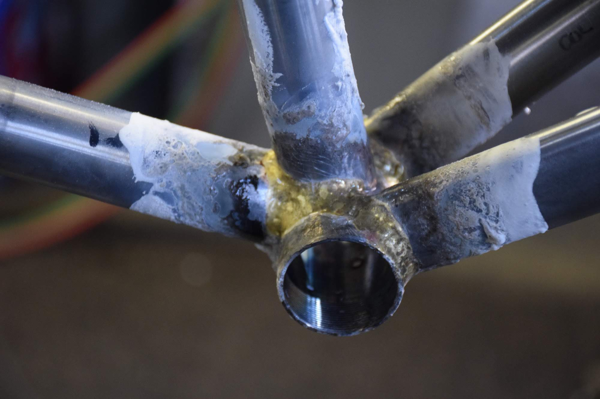
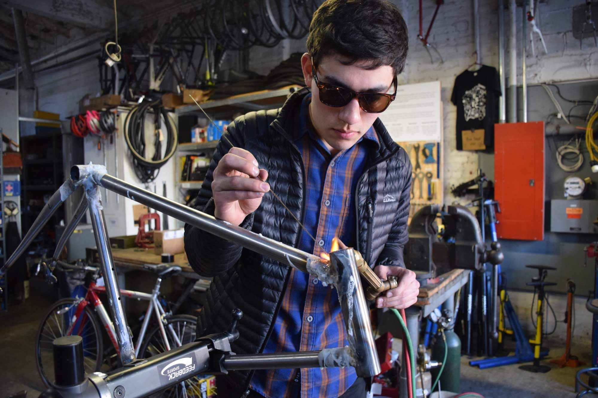
```

Steel bike frames are either TIG welded, lugged + silver brazed, or bronze fillet brazed. Most beginners start with a lugged frame, but I assumed pre-made lugs wouldn't be compatible with MTB geometry, let alone my weird long-seatpost geometry. I didn't have a TIG welder available, and they tend to cost at least $1000 for a minimum-viable setup. So, I went with fillet brazing. Fillet brazing involves heating the steel tube joints to a high temperature with a torch, then melting bronze rod into the seams, forming nice mounds of bronze called *fillets*. John already had an oxy-acetylene torch, flux, and brazing rod at the shop, so I was good to go.

Flux (light blue paste) must be applied to a joint before being brazed. Flux reduces oxidization when heat is applied, allows the brazing material to flow easier across the metal, and more generally provides a buffer between the torch and the steel.

The main triangle's joints are first tacked in the jig. The frame is then removed and placed on a bike stand for maneuverability, allowing the fillets to be completed.

The goal when fillet brazing is to get the tubes just hot enough, and hot in the right places, so that the bronze flows well and in the direction you want. It's important that the tubes don't get *too* hot, or else the structural integrity can be weakened (or worse, you can burn a hole through the tube).

After brazing the tubes, I brazed on some water bottle and brake hose bosses using silver braze. Silver is better for small braze-ons because it wicks faster and farther into fine joints, and also melts at a lower temperature.

## Disc Brake Tab Attachment

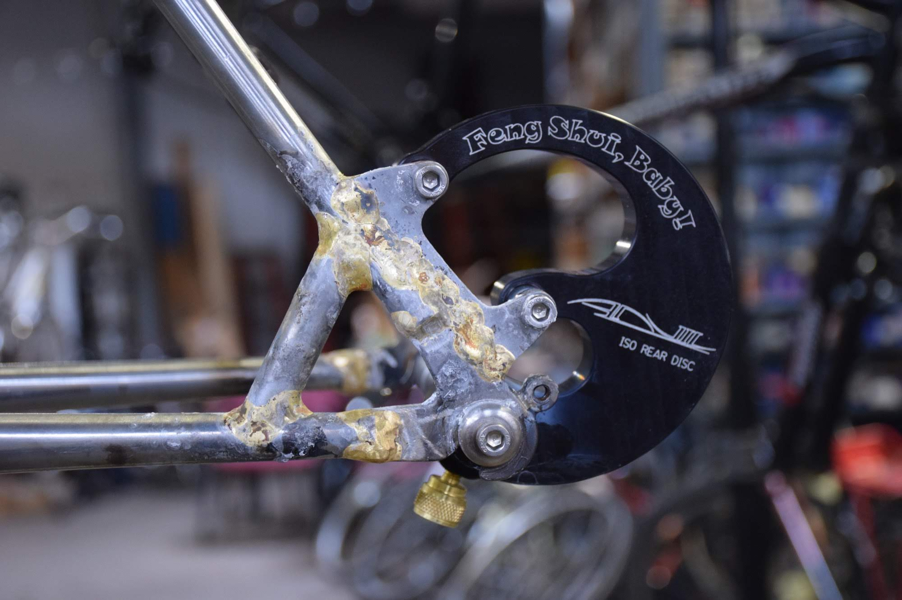

ISO is still the standard disc brake tab mount for metal MTB frames. The main benefit compared to post mount is that the holes are unthreaded, which avoids the possibility of a post mount thread being stripped. It's also the easiest standard to conceptualize -- the ISO tab's inner face is in plane with the end of the hub's [quick-release] axle, the holes are a fixed distance apart, and the holes are at two different defined radii from the center of the axle.

There are two ways to go about disc brake frames:
- Purchase a ready-made dropout that has an integrated disc brake mount, or a modular system that allows a disc brake mount to be bolted on. Paragon Machine Works sells a few different solutions.
- Use a normal dropout, then attach a disc brake mount to the stays separately. I went for this method. The mount is usually placed on the seatstay, with a brace tube attached between the seatstay and chainstay to prevent the it from buckling. The mount can sometimes be placed on the chainstay, though in my case there wasn't enough clearance for the caliper given the angle/placement of the seatstay.

To locate the tab holes in plane and at the correct distances from the axle, a specialized fixture must be used. I purchased an Anvil Feng Shui and Anvil 137.5mm dummy axle for this.

I spent a while going back and forth between the frame and bench grinder, attempting to match the bottom of the tab to the seatstay's profile. After I got a good fit, I used the Feng Shui to locate the disc brake tab in its final position, then brazed it with a thick bronze fillet.

Finally, I improvised a brace tube by mitering a small piece of excess seatstay and brazing it into place, attempting to approximate an equilateral triangle between the brace, seatstay, and chainstay. Mitering it was easy because the diameter of my round files were pretty close to the diameter of the stays at that point.

## Alignment

```gallery


```

As mentioned, applying heat has the side effect of distorting the frame. In my case, relative to the BB:
- head tube was off center
- dropout width was too wide
- dropouts were twisted
- dropouts weren't centered
- derailleur hanger was bent

Therefore, metal frames must be *cold-set* (bent) until they are aligned. I used a combination of these alignment/straightening tools (found in most bike shops):
- Park Tool FAG-2 (frame alignment gauge)
- Park Tool FFS-2 (frame straightener)
- Park Tool FFG-2 (dropout alignment gauge/straightener)
- Park Tool DAG-2.2 (derailleur alignment gauge/straightener)
- Large bench vise to clamp the frame at the BB
- Custom dropout width (O.L.D.) gauge
- 2x4s

I performed minor alignment before brazing in the seatstays and disc tab, then again after.

The tricky part is that making a correction to one area can throw other areas off (similar to truing a wheel). So, I went back and forth, trying to make incremental corrections. I also had to file down some of the NDS dropout slot to get the wheel centered behind the seat tube. Eventually, it found alignment.

## Finishing

```gallery
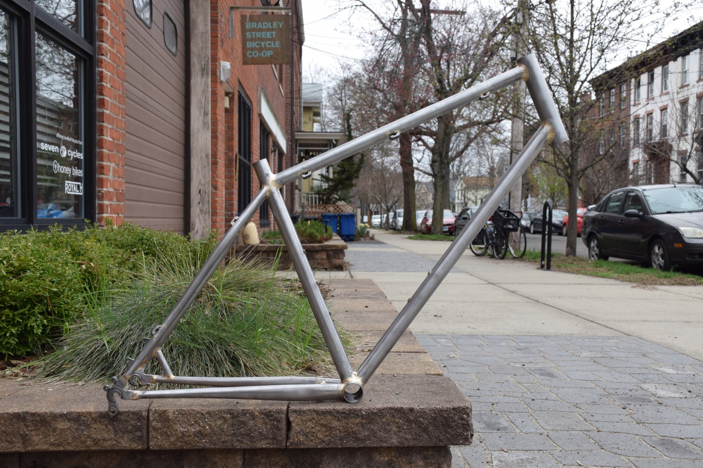
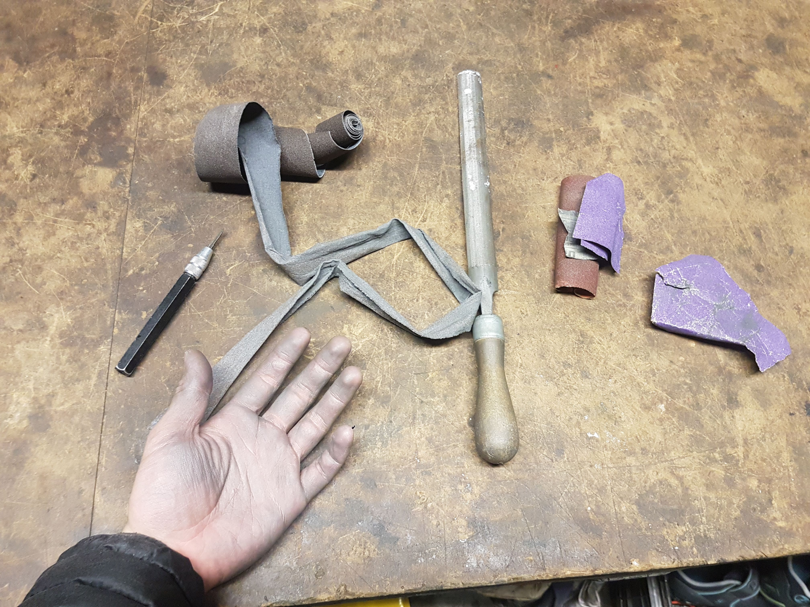
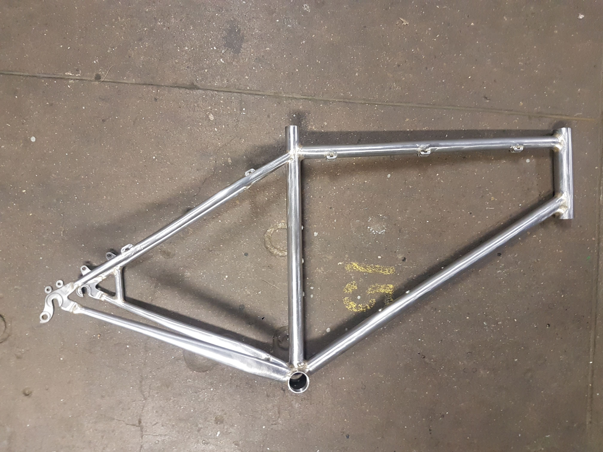
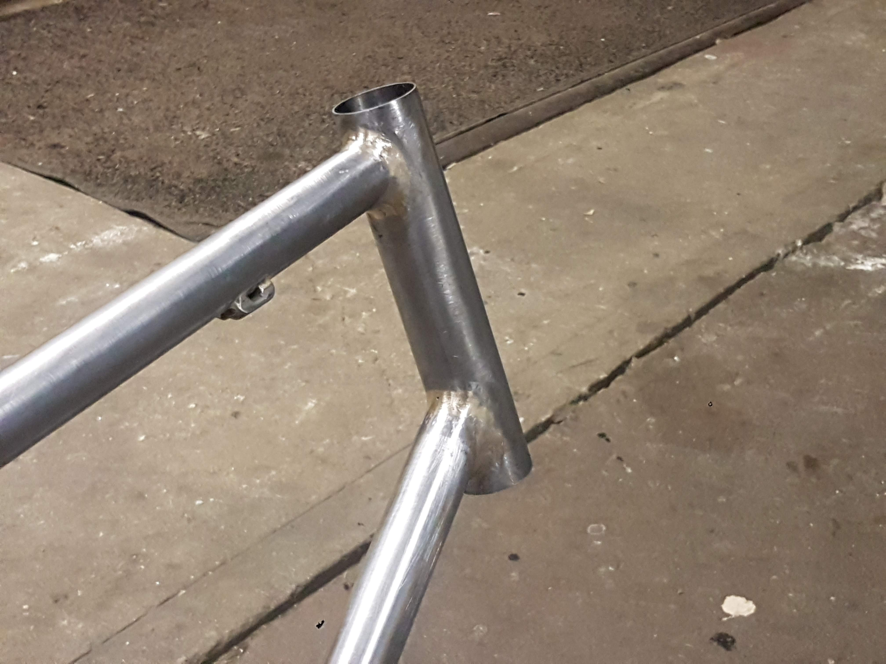
```

After the fillets are placed, they must be smoothed. To do this, I used:
- A Dynafile (specifically the Astro Pneumatic 3036 Air Belt Sander)
- Nicholson round and half-round files, bastard and 2nd cut
- Plumber's cloth
- Sandpaper

The dynafile was kinda unwieldy, and I went through belts quickly, though perhaps I didn't have quality belts. I probably would have done fine without it.

The trickiest part was smoothing the fillets under the seatstay-seat tube joint. It was impossible to get a file in there. I ended up leaving close to as-is. Next time I will build up a larger fillet, attach the seatstays farther from the center, and/or use smaller-diameter seatstays.

Overall, smoothing the fillets was probably the most time-consuming part of the build. I could have spent even longer, maybe adding some more material and getting rid of pinholes. I wasn't too concerned with aesthetics though, and thought it was good enough for my first frame. Now that I have at least some brazing skill, the results should be much better for my next frame.

## Paint

```gallery
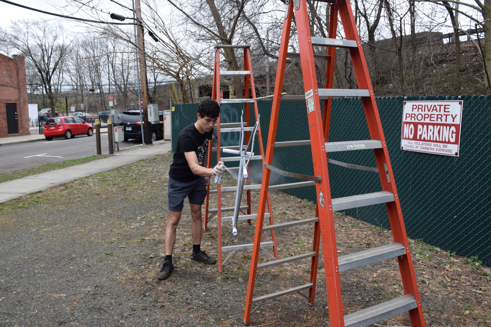

```

I decided to go for ordinary spray paint. If it ends up not holding up to city use, I can always have it professionally stripped and powdercoated. Also, I really wanted to try my hand at a sick cyan/sand vertical fade!

I used Rustoleum Automotive Primer, MTN 94 cyan and sand colors, then finally Rustoleum 2x Clear Gloss.

General guide:
- Suspend frame using a wire through a dropout rack eyelet. I connected the wire to a rod held between two ladders outdoors.
- Put rolled-up printer paper in BB, head tube, and seat tube.
- For primer, I used two coats of Rustoleum Automotive Primer.
- For color, I used three coats of MTN 94 (technically for graffiti, but great color selection!)
- For clear, I used two coats Rustoleum 2x Clear.
- Wait a day or so between primer/color/clear.
- Wet sand previous layer before color/clear.

This is my first time attempting to get a good finish from spray paint. I was able to sand out most of any orange peel that showed up, however, I'm not sure exactly how much of the layers I removed when doing so.

I'm pretty happy with the end result aesthetically. The fade turned out exactly as envisioned. Time will tell how it holds up.

## Tap/Ream/Face

The last step is cleaning up the various frame-component interfaces:
- Tap rear derailleur hole with standard 10x1mm tap
- Ream seat tube to 27.2mm with adjustable reamer
- Tap/face bottom bracket shell with Park Tool BTS-1
- Ream/face head tube with Park Tool HTR-1. Big thanks to Devil's Gear for letting me use theirs.

## Done!

```gallery
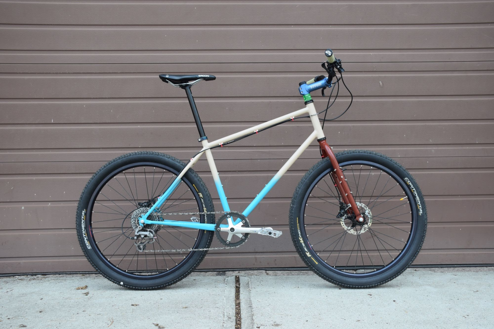
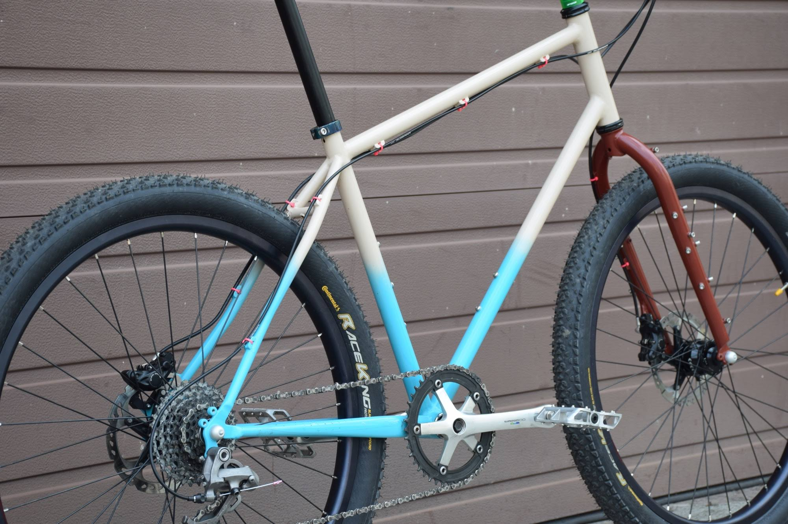
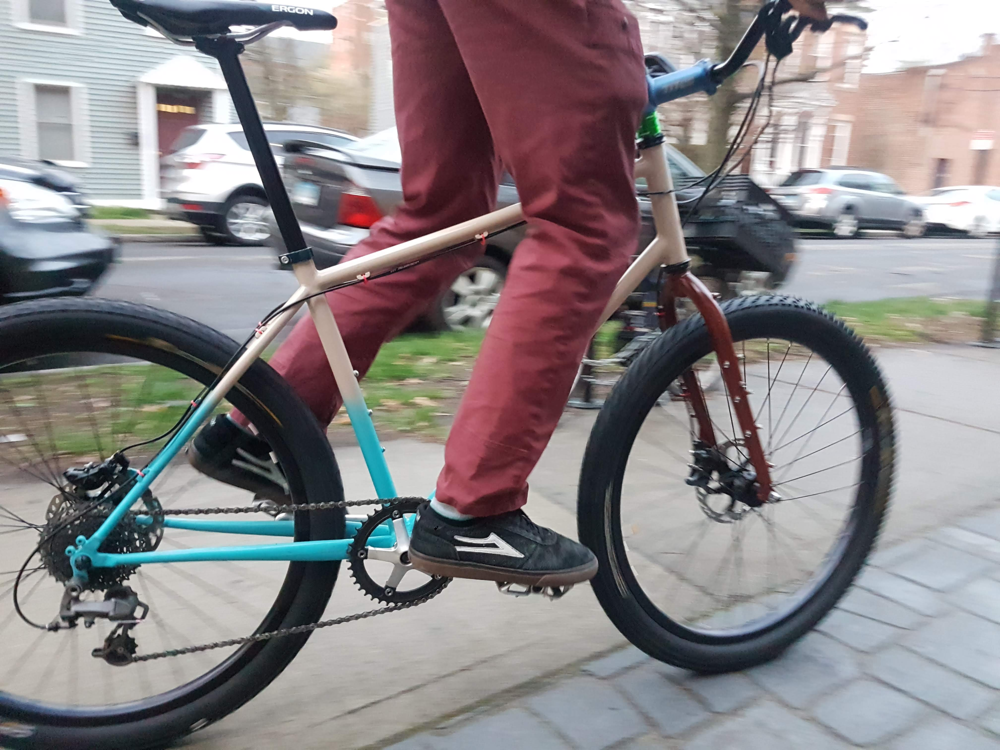
```

Final frame weight with paint is 1960g (4.32lb). Not bad at all. For reference, my 2014 Kona Raijin Titanium L frame is 2010g, and my 2018 Surly Karate Monkey XL frame is 3000g.

Parts for build:
- Built some wheels around Velocity Cliffhanger rims, a Shimano SLX M7000 rear hub, and an SP PD-8 dynamo front hub
- Surly Troll fork
- Continental Race King Protection 26x2.2" tires, set up tubeless
- Shimano 600 Tricolor crank arms, J&L narrow-wide chainring
- Shimano Saint M810 rear shifter
- Shimano XTR M952 rear derailleur
- Shimano SLX M7000 hydraulic brakes, Shimano XT RT81 IceTech rotors
- Promax SP-1 Seatpost
- Vintage Titec MTB stem
- Dimension handlebars
- FSA Polycarbonate headset spacers
- Cane Creek 10 headset
- MKS Allways pedals
- Renthal Traction Lock-on Aramid grips

This was a super fun project. A huge thanks to John/BSBC for access to the space, jig, and tools. It feels amazing to blast down New Haven's streets every day on a frame I made myself! I can't wait to make my next frame.

Also planning on making an accompanying front porteur rack, so stay tuned for that post.

I'm happy to answer any questions, especially if you're looking to build your own frame. Send me a message!
