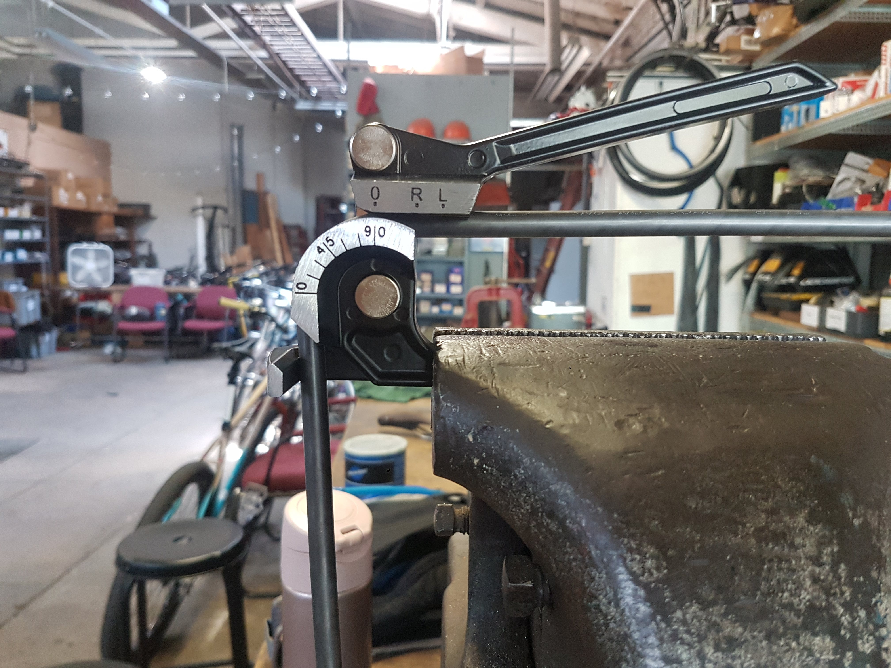

After building a [commuter-mtb bike frame](/building-my-first-bike-frame) I wanted to make an accompanying front rack. I had been using a porteur rack by Velo Orange for the past few years but was never quite happy with it. It looks nice and is fine for smaller loads, but there's some noticeable flex when carrying larger loads (like my backpack on humid days). Its flex is due to a few factors. The lower struts connect at the fork dropout, which is too far from the platform/load. Also, the thin upper strut simply holds the rack in position, providing little to no actual support. These flaws aren't exlusive to the Velo Orange rack. Looking at photos, it seems most porteur racks suffer from similar flaws. The burliest production porteur rack I know of is the Surly 24-pack, but the attachment system is kinda sketchy (it was later recalled). So, I decided to make my own.

## Design


I decided on these specs for my rack:
- Fit to my specific fork, the 2019 Surly Troll fork. It might work with other Surly forks.
- No adjustment mechanisms, mounting directly in order to maximize stiffness and strength.
    - Upper struts connect directly to upper rack mounts (instead of brake hole).
    - Lower struts connect directly to mid-fork rack mounts (instead of mounts at dropout).
- 3/8" diameter, .028" wall 4130 steel tubing. There's a great comparison of the ~six reasonable steel tubing dimensions for racks on Alex Wetmore's blog [here](http://alexwetmore.org/archives/501.html). I chose this tubing because it's about three times stiffer than traditional 1/4" tubing and only slightly heavier.
- Platform should be just above the tire for low center of gravity / stability.
- 16x12" platform. About the size of a Wald 139 basket. Large enough to support a pizza box. The platform braces have a "broken glass" aesthetic.

## Tools

- Cheap hand tube bender with 1" radius. These things are only meant to be used on soft metals like copper, so use at your own risk.
- 3/8" Nicholson bastard file and bench grinder for mitering
- "Found tools" for fixturing, including a bench vise, mini vise grips, bent spokes, and string
- Bike/fork for final leveling and fixturing
- Oxy-acetylene torch setup
- Square

## Rack Tabs


Rack tabs connect the struts to the fork. There are some available from Framebuilder Supply and Rene Herse, but I decided to make my own. They're pretty simple. There's a rectangular end that fits perfectly into the end of the tube (using a "largest rectangle you can inscribe in a circle" calculation). The other end has a clearance hole for an M5 bolt and a nice radius/taper down to the tube's outer diameter. I drew them up in Inkscape (email me if you want the file). I then purchased some 1/8" mild steel sheet (A366/1008 cold rolled).

My friend Dante was leaving his job at Yale's makerspace so I quickly tasked him with cutting the tabs out on their waterjet. If you don't know what a waterjet is...well...check out an [anvil being cut in half](https://www.youtube.com/watch?v=quL14Csmi_Y&t=132) by one.

They turned out great! Thanks Dante.

## Platform

```gallery




```

I began with the perimeter. The start and end of the loop is at the center of the leading edge. I chose for the platform dimensions (16x12") to refer to the *centerline* of the tubing. Therefore, the actual outer perimeter is increased by `(tube diameter)/2 = .375"/2 = .1875"` on each side, yielding the final outer dimensions 16.375x12.375".

How do you determine where to place the bends? Tube benders have a specified centerline radius ("CLR") that refers to the distance from the center of the arc to the centerline of the tube. My bender has a 1" CLR. Since the start of the loop is in the middle of a 16" section, the start should be 8" from the centerline of the next edge. Therefore, the first bend should begin at `8" - CLR = 7"` from the beginning of the loop. After attempting the first bend, I lined it up against a square on the workbench to check my work. I often had to go back to the bender to make small adjustments. For the second bend, I again lined it up against the square, but instead of pushing it up against the edge, I visually aligned it with outer perimeter. If I had pushed it up against the edge, it would have required some trig involving the thickness of the square and diameter of the tube to determine how much to offset; simply aligning it visually with the outer perimeter was easier. I then marked marked off the start of the second bend at `12" + (tube diameter)/2 - CLR = 11.1875"`. I continued this process until the loop was completed.

```gallery


```

I closed the loop by clamping both ends of the open loop in a bench vise, then tacking it. I then unclamped it and finished brazing the joint. To make the transition less obvious, I filed down most of the bronze.

I then "filled in" the platform with braces. I measured the brace lengths and positions on my drawing, then scaled it up. I mitered them by hand with a 3/8" bastard file and bench grinder. Finally, I fixtured them using the bench vise and mini vise grips and brazed them up. Quick and easy!


## Struts

```gallery


```

Luckily, having the platform at the same height as the fork's upper rack mounts yielded the rack-tire clearance I was looking for. Therefore, the upper struts could be in-plane with the rest of the platform, making it easy to locate them at the right angle.

I wanted the upper struts to be a few inches long in order to offset the platform from the handlebars and brake hoses. In theory this should give me more clearance to carry taller cardboard boxes. However, I ended up kinda regretting this in the end, as placing the load this far forward affects the handling a bit.

I rough-cut the upper struts to their approximate length, then brazed in the rack tabs. After mitering the other end, I fixtured it using an old bent spoke to hold it at the top, and a straightedge to keep it in-plane.

```gallery


```

At this point, only the lower struts were left. I used the bike and fork themselves to fixture the upper part of the rack in place. I put the bike on the ground and suspended the upper rack in place with a piece of string hanging from the handlebars. This allowed me to find a good angle for the rack; pretty close to level, maybe one degree or so pointed up towards the front. After preparing the lower struts in a similar fashion to the upper struts, I went back and forth between the fork-rack fixture and the vise to miter the ends. Note that I purposefully didn't attach the two lower struts at the same x positions on the platform (for some additional cool factor, and also limitations of the broken-glass platform design). I had considered simply attaching them to the leading edge of the platform, but decided that angle would have been too narrow and would place more shear stress on the joints.

Finally, I compressed the suspended rack against the lower struts with some bungie cords and brazed them in place.

## Done!

I decided to leave it raw/unfinished and just let it rust. The flux weathered away pretty quickly.

The final result is both light and stiff. Actually, way stiffer than I thought it would be. I zip-tied a Wald 139 basket on top and it works great!

Final weight was about 600g. Compare to the Surly 24-Pack at 860g or the Velo Orange Porteur Rack at 1000g.

Total cost was about $70.


## 3-month Update: Still Going Strong, Also, Rust Is Cool


