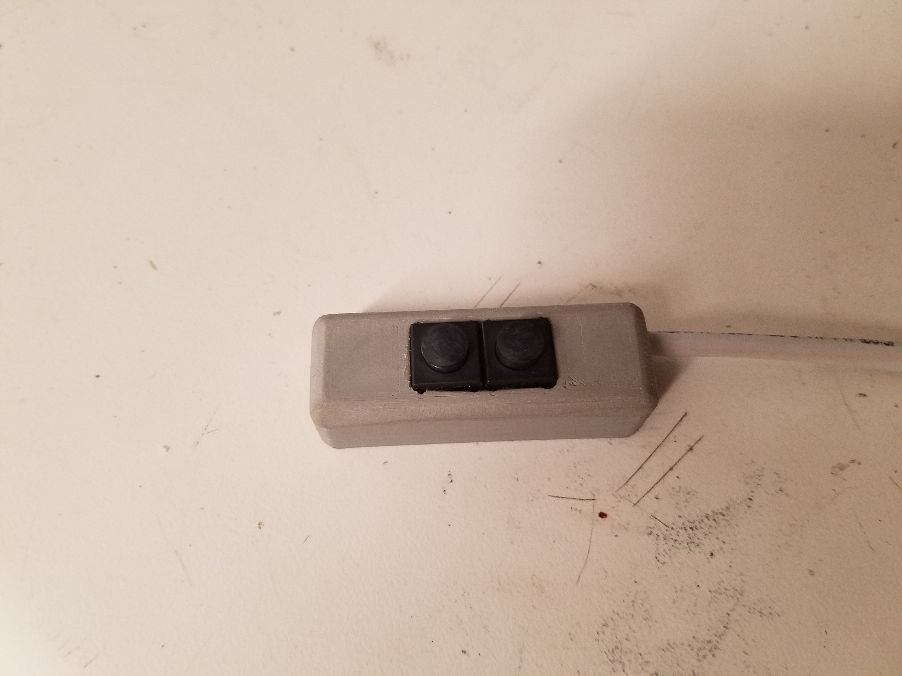

I'm planning on racing the 2020 edition of [The Adirondack Trail Ride](https://theadirondacktrailride.com/) this coming weekend. TATR is a 580-mile self-supported ultra-endurance bicycle race and I plan on going all out! It's about 48% paved road, 36% gravel/dirt road, 11% singletrack/hike-a-bike, and 5% doubletrack. Given the ~65 miles of singletrack, I will be bringing my hardtail mountain bike.

I've done a fair bit of long-distance riding at this point, from multi-month bike tours to [a go at the 2017 Trans Am Bike Race](https://cyclingtips.com/news/andrew-suzuki-leads-the-trans-am-bike-race/). In all of these rides, I develop considerable hand fatigue. Simply shifting the bike becomes a nontrivial effort. Therefore, like most successful ultra-endurance racers, I wanted to set my MTB up with electronic shifting -- specifically, Shimano Di2. Shifting requires less effort (theoretically), remote shifters can be added to the aerobars, and once adjusted initially, it shouldn't require any further adjustment until the cassette is replaced.

The problem with Shimano's Di2 MTB shifters is that were basically designed to replicate the ergonomics of their mechanical shifters (see [this video](https://www.youtube.com/watch?v=_PY8YaTxOdM)). I would rather have switches with a low actuation force, short travel, and located right next to each other in the optimal position. Additionally, I didn't want to spend an extra $200 for the remote aerobar shifters. So, decided to make my own MTB and aerobar shifters.

## Junction

```gallery


```

The two shifters will simply enclose "dumb" switches. Di2, however, uses a proprietary protocol, so I needed a converter from "dumb" switches to that.

Luckily, this is already [well-documented](http://dinosarti.com/blog/2013/5/23/hacking-the-heck-out-of-my-di2-9070) on the internet as a "Di2 hack", popular among triathlon racers who want lower-profile switches on their aerobars. It's pretty simple, just buy a remote Di2 shifter (either the aerobar shifter or the climber's shifter), take it apart to expose the switch terminals, solder wires to those terminals, and [pot](https://en.wikipedia.org/wiki/Potting_(electronics)) everything in epoxy. I went for the SW-R600 climber's switch (about $68).

Dissection was a success. I printed a simple enclosure, soldered on a pair of 4-wire JST-SM connectors, and finally sealed it with silicone potting compound. It isn't pretty, but it'll do the trick.

## MTB Shifter

```gallery


```

Instead of designing a shifter that clamps directly to the handlebar (bulky), I decided to have it interface with Shimano I-Spec II. I-Spec II is one of Shimano's solutions for mounting a shifter to the same clamp as the brake. This results in a much cleaner look because the printed plastic shifter can now bolt directly to the mounting bracket, all while being securely held and allowing adjustment. I was able to reverse-engineer the interface by measuring my current mechanical shifters.

For buttons, I spent a few hours looking through a few hundred tact switches available at DigiKey. Perhaps a standard hobby tact switch would have been fine, but I wasn't completely sure it would hold up to the elements (rain and dirt), so I splurged on some $3 waterproof/dustproof switches with a low actuation force (Apem/MEC 3ETH9-08.0).

The enclosure is pretty simple. I-Spec II mount, shifter body with an inset bed for the switches, and an internal tube to run the wires to a port on the left side. I soldered the switches to wires and again potted it with silicone.

## Aerobar Shifter

```gallery




```

Since this is going on a mountain bike, the aerobar shifter should be in a position that is less likely to be damaged in a crash, i.e. not plugged directly into the end of the aerobar tubes. I decided to mount it to the inner side, secured with zip ties. The bottom side is radiused to fit the standard 22.2mm tube diameter.

## Done


Works great! An initial concern was that the buttons would be *too* easy to press, and I would accidentally them when going over technical terrain. Luckily, that isn't the case. I can cover both buttons with my thumb and rock it side to side to actuate them with ease.
